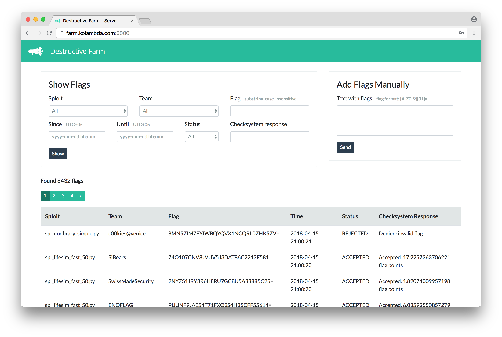

Destructive Farm
================

Ферма для attack-defense CTF-соревнований

## Что такое attack-defense CTF?

**Attack-defense CTF** &mdash; это командное соревнование по информационной безопасности. Каждой команде выдаётся одинаковый образ операционной системы с запущенными в ней *сервисами* (такими как форум или веб-сервис с предсказаниями погоды), которые содержат уязвимости. Задача команды &mdash; найти уязвимости, после чего защитить свои сервисы и атаковать чужие, украв секретную информацию (*флаги*).

Во время игры на серверах жюри работает *проверяющая система*. Каждые несколько минут она проверяет, что сервисы команд работают, и добавляет в них новые флаги.

## Зачем нужна ферма?

Так как новые флаги добавляются постоянно, недостаточно взломать сервис противника один раз вручную. Обычно пишут скрипт (*эксплоит*), который крадёт флаги у заданной команды, а потом регулярно запускают его на каждой из команд-соперников.

Ферма решает ряд проблем, связанных с этим процессом. Например, ферма:

- Позволяет не реализовывать процесс отправки флагов в каждом эксплоите
- Перезапускает эксплоиты на всех командах раз в заданный период времени
- Останавливает зависшие процессы с эксплоитами
- Следит, чтобы квота на отправку флагов в проверяющей системе не была израсходована
- Защищает от спама флагами (когда одна из команд размещает в своём сервисе большое количество ложных флагов)
- Позволяет следить за результатами работы сплоитов и статистикой отправляемых флагов
- Переотправляет флаги в случае, если проверяющая система упала и не могла их принимать в течение некоторого периода времени

## Составные части фермы

**Эксплоит** &mdash; это скрипт, который позволяет красть флаги в определённом сервисе у команд-противников (тех из них, которые ещё не защитились от используемой уязвимости). Пишется участником во время соревнования. Должен принимать хост (IP или домен) команды-соперника в качестве первого аргумента командной строки (`sys.argv[1]`), атаковать команду и выводить флаги в stdout.

[Пример эксплоита](client/spl_example_runme.py) | [Подробнее о формате эксплоита](docs/exploit_format.md)

**Клиент фермы** &mdash; это утилита, которая регулярно запускает эксплоит, чтобы атаковать чужие команды, и следит за его работой. Запускается участником на своём ноутбуке после написания эксплоита.

Клиент представляет собой скрипт *start_sploit.py* из данного репозитория. Для запуска требуется Python 3 и ОС Linux, macOS или Windows. Клиент не требует установки каких-либо библиотек.

[Подробнее о клиенте](docs/farm_client.md)

**Сервер фермы** &mdash; это утилита, которая собирает флаги от клиентов фермы, следит за использованием квот, централизованно отправляет флаги в проверяющую систему и показывает статистику по принятым и некорректным флагам. Настраивается (см. *config.py*) и запускается администратором (одним из членов команды) в начале соревнования. Во время соревнования члены команды могут воспользоваться веб-интерфейсом сервера (см. скриншот выше), чтобы следить за результатами работы сплоитов и статистикой отправляемых флагов.

Сервер представляет собой веб-сервис (на Flask) из папки *server/* в данном репозитории. Для запуска требуется Python 3 и ОС Linux или macOS. Сервер зависит от нескольких библиотек, но не требует установки на компьютер дополнительного ПО (такого как MySQL или Redis).

Стандартно поддерживаются протоколы отправки флагов, используемые на соревнованиях RuCTFE, RuCTF и VolgaCTF, но вы можете добавить и поддержку других протоколов.

[Подробнее о сервере](docs/farm_server.md)

*Диаграмма*

## FAQ

**Q: Зачем ферма делится на клиент и сервер?**

A: ...

**Q: Что используется в качестве БД для хранения флагов?**

A: Флаги на сервере фермы хранятся в БД SQLite. SQLite выбран потому, что ...

**Q: ... asyncio ...?**

A: ...

## Планы на будущее

...

## Другие фермы

- [Ферма](https://github.com/alexbers/exploit_farm) Бэя &mdash; более простая ферма, архитектура и некоторые детали реализации которой были заимствованы в этом репозитории. В ферме Бэя используется такой же формат эксплоита и тоже есть деление на клиент (*start_sploit.py*) и сервер (*start_posting.py*) фермы. Однако, у Бэя они должны быть запущены на одном компьютере, а сервер не предоставляет веб-интерфейс для просмотра статистики (и ряд других функций).

- [Ферма](https://github.com/andgein/ctf-exploit-farm) Андрея Гейна &mdash; ферма, решающая проблему с большим количеством процессов при большом количестве команд с помощью асинхронного сетевого взаимодействия (`asyncio`). Накладывает ряд ограничений на используемые эксплоиты: они должны быть написаны на Python и взаимодействовать с сетью только асинхронно.

## Авторы

Copyright &copy; 2017, 2018 Александр Борзунов (команда &laquo;Destructive Voice&raquo;)

Архитектура и некоторые детали реализации заимствованы из [фермы](https://github.com/alexbers/exploit_farm) Бэя (Александра Берсенева).
